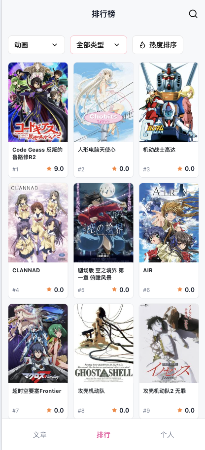
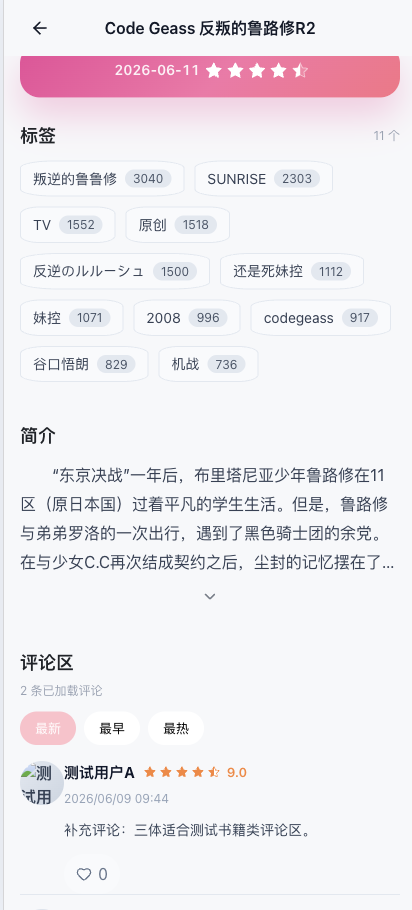
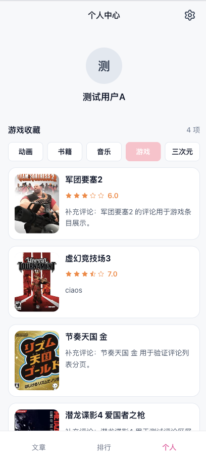
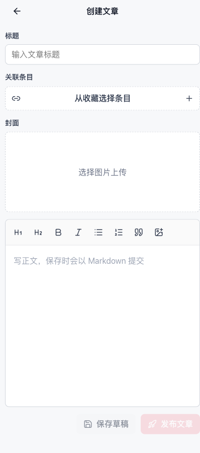

# cBangumi

cBangumi 是一个基于 React + TypeScript + Vite 的 Bangumi 条目、评分、收藏与文章前台项目。项目提供条目检索、排行榜、条目详情、用户收藏/评分/评论、文章浏览，以及管理员文章管理能力。

## 在线预览

[https://cvnranking.netlify.app](https://cvnranking.netlify.app)

## 页面展示

| 文章列表                                          | 条目排行榜                                         |
| ------------------------------------------------- | -------------------------------------------------- |
|  |  |

| 条目搜索                                        | 条目详情                                                |
| ----------------------------------------------- | ------------------------------------------------------- |
|  |  |

| 个人主页                                         | 文章编辑                                                |
| ------------------------------------------------ | ------------------------------------------------------- |
|  |  |

## 功能

- 条目浏览：排行榜、关键词搜索、条目详情、标签与简介展示。
- 用户系统：注册、登录、登录态恢复、个人资料、头像设置、密码修改。
- 收藏与评价：为条目设置收藏状态、评分和短评。
- 评论互动：查看条目评论、按时间或热度排序、点赞/取消点赞。
- 文章系统：文章列表、文章详情、关联条目展示。
- 管理功能：管理员创建、编辑、发布、隐藏、删除文章，支持文章图片上传。
- 部署支持：Vite 开发代理、Netlify Functions API 代理、Docker + Nginx 静态部署。

## 本地开发

安装依赖：

```bash
pnpm install
```

启动开发服务器：

```bash
pnpm dev
```

默认情况下，Vite 会把 `/api` 代理到 `http://localhost:8080`。如果后端地址不同，可以创建本地环境变量文件：

```bash
VITE_PROXY_TARGET=http://localhost:8080
```

也可以通过 `VITE_API_BASE_URL` 指定前端请求的 API 基础地址：

```bash
VITE_API_BASE_URL=
```

当 `VITE_API_BASE_URL` 为空时，前端会请求同源 `/api`，适合配合 Vite、Netlify 或 Nginx 代理使用。

## API 与登录态

项目使用 Axios 统一封装请求，默认开启 `withCredentials: true`，登录态由后端 Cookie 维护。

开发环境：

- 前端请求 `/api`
- Vite 将 `/api` 代理到 `VITE_PROXY_TARGET`

Netlify 环境：

- `netlify.toml` 将 `/api/*` 重写到 `/.netlify/functions/api-proxy/:splat`
- `netlify/functions/api-proxy.cjs` 通过 `API_ORIGIN` 转发到真实后端
- 代理会透传上游 `Set-Cookie`，用于维持登录态

Netlify 需要配置：

```bash
API_ORIGIN=https://your-api.example.com
```

## Docker 部署

项目提供多阶段 Dockerfile：

1. 使用 `node:22-alpine` 安装依赖并构建前端。
2. 使用 `nginx:1.27-alpine` 托管 `dist/` 静态文件。
3. Nginx 将 `/api/` 代理到 `API_PROXY_PASS`。

使用 Docker Compose：

```bash
docker compose up -d --build
```

默认配置会把 API 代理到：

```bash
http://host.docker.internal:8080
```

如需修改后端地址，调整 `docker-compose.yml` 中的 `API_PROXY_PASS`。

## 路由概览

- `/articles`：文章列表
- `/articles/:articleId`：文章详情
- `/ranking`：条目排行榜
- `/search`：条目搜索
- `/subjects/:subjectId`：条目详情
- `/login`：登录
- `/register`：注册
- `/profile`：个人主页
- `/settings`：账户设置
- `/settings/password`：修改密码
- `/articles/new`：新建文章，管理员可访问
- `/articles/manage`：文章管理，管理员可访问
- `/articles/:articleId/edit`：编辑文章，管理员可访问
